Project Introduction
====
The project is to build a online education platform website application. The application is built using Django framework, the Xadmin plug-in is used to extend the Django build-in admin. The MySQL is applied as storage solution.

The functionalities of the platform is decomposed into 4 apps, User, Organization, Courses, Operations.

1. The User app is responsible for User Account management.
2. The Organization app is responsible for Educational Organization and Teacher management.
3. The Course app is responsible for Course management. 
4. The Operations app is responsible for users' operations in the platform.

Snapshots of the project
====
**1. Home Page:**
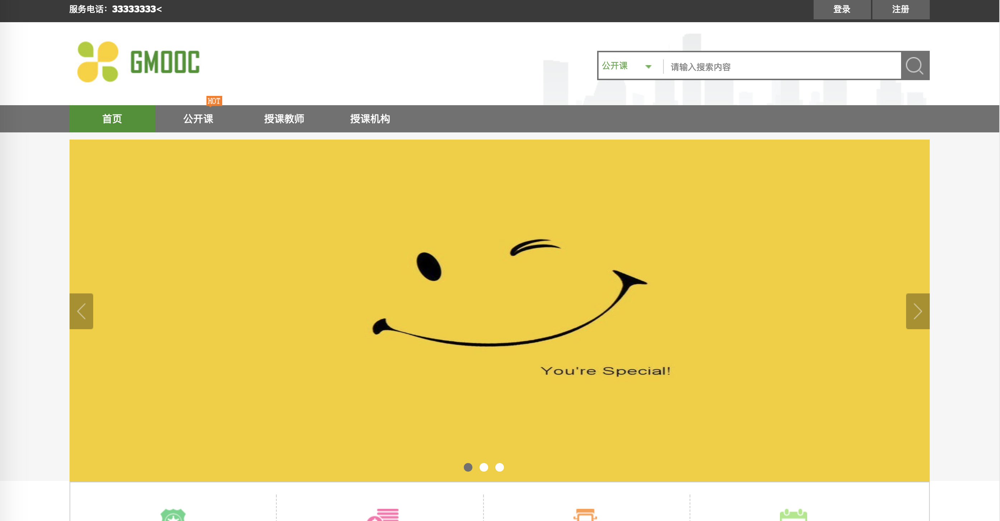
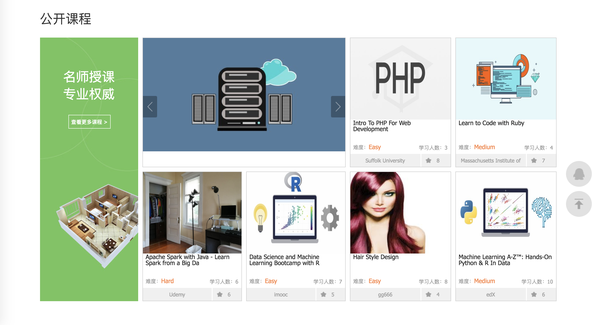
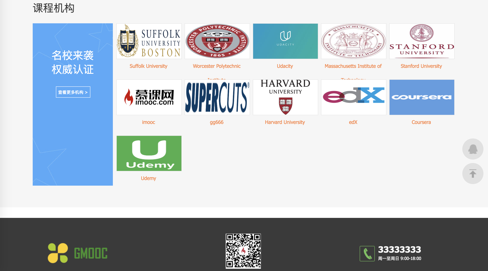
**2. User Account Management:**
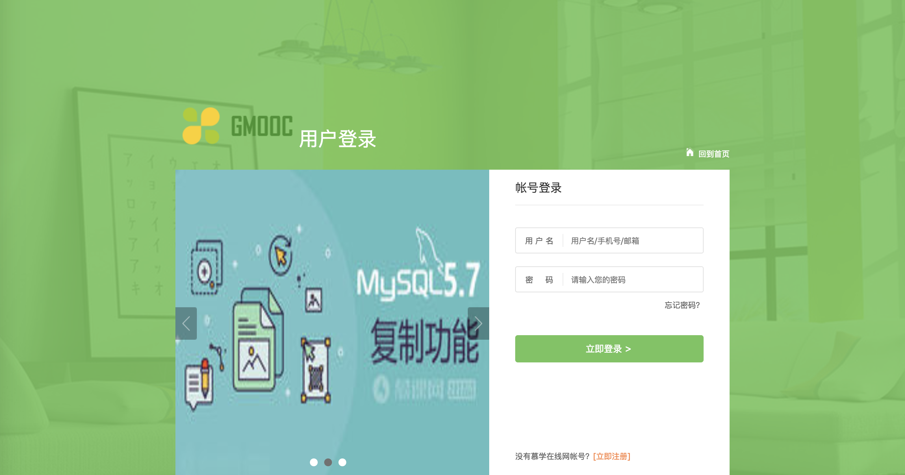
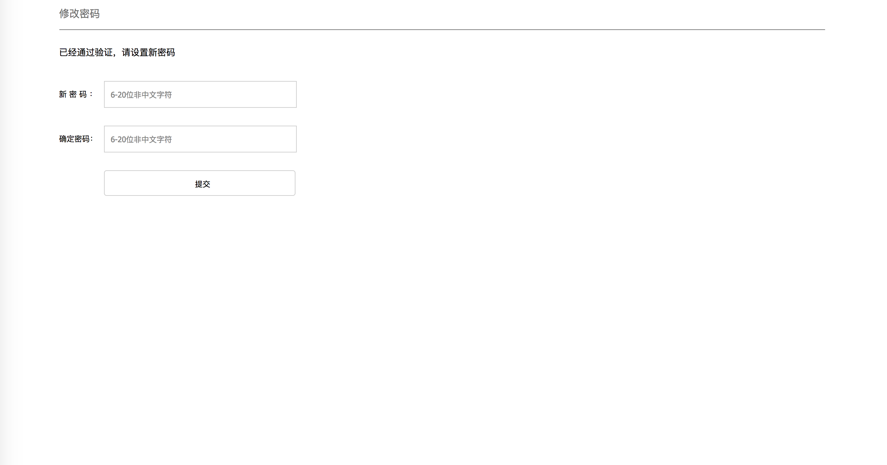
**3. Course Page:**
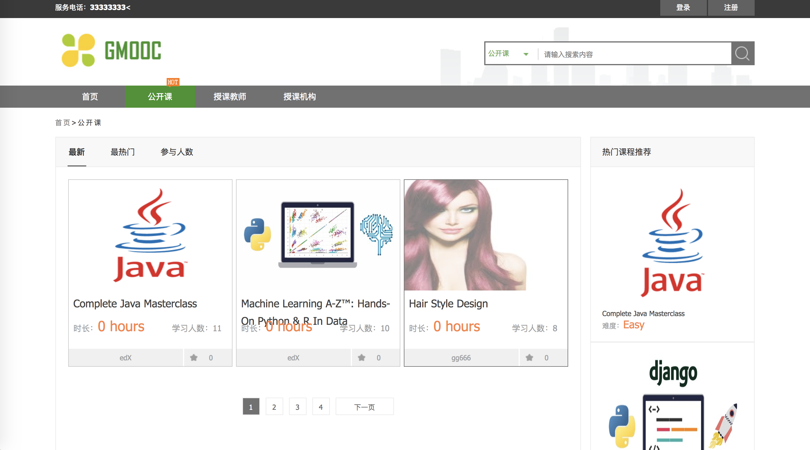
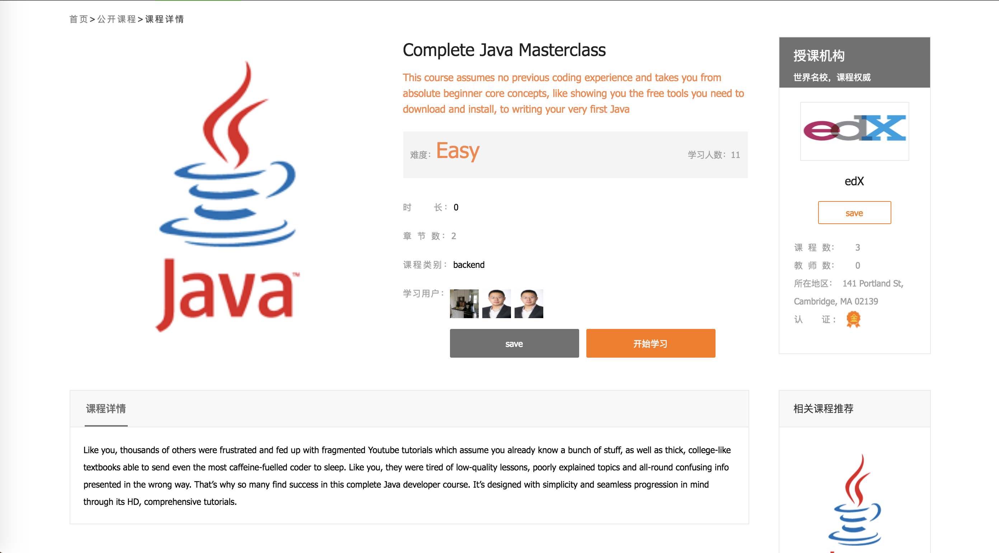
**4. Teacher Page:**
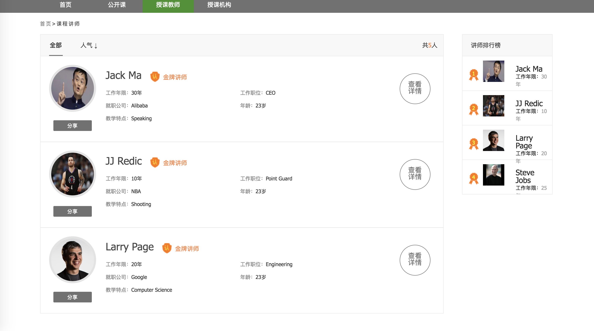
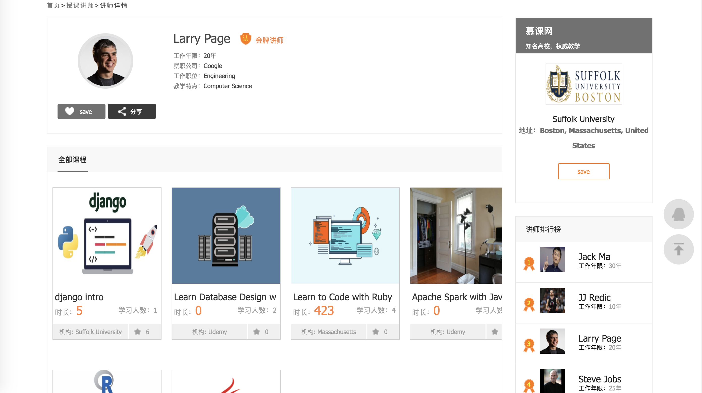
**5. Organization Page:**
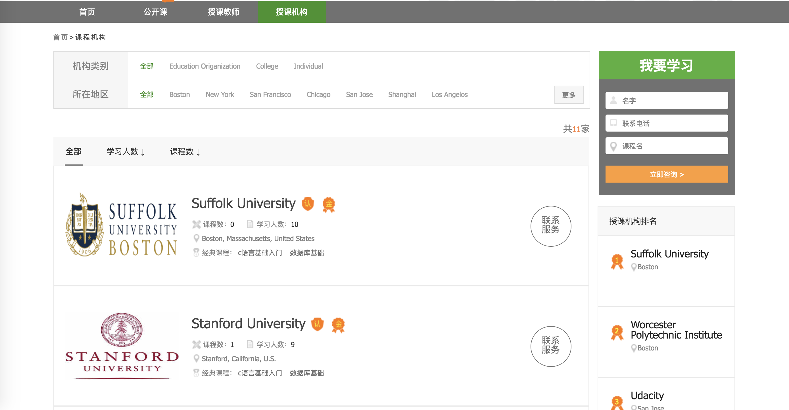
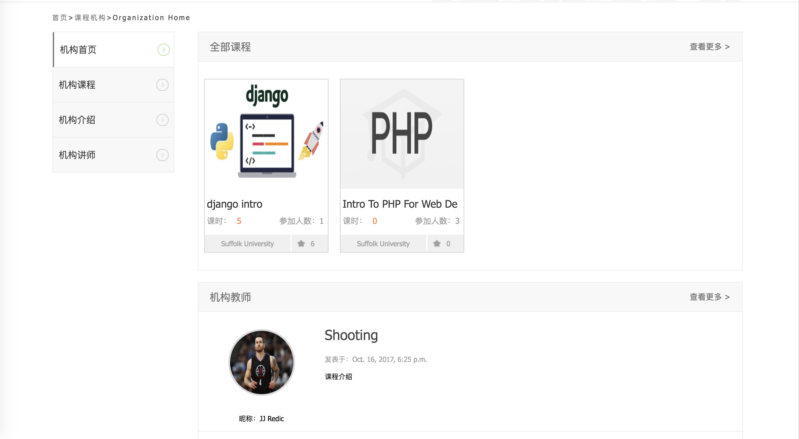
**6. User Center:**
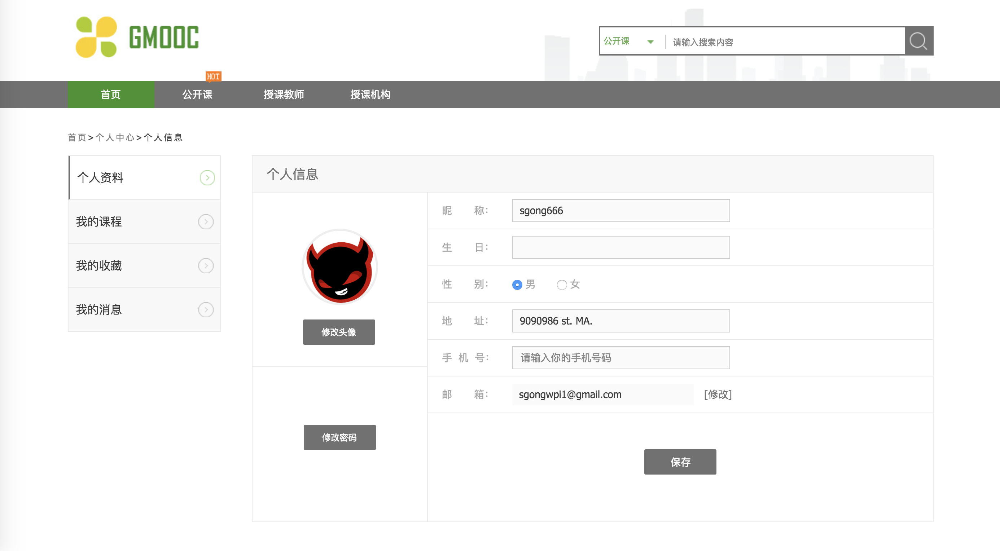
**7. Global Search:**
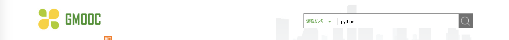
**8. Administration System:**
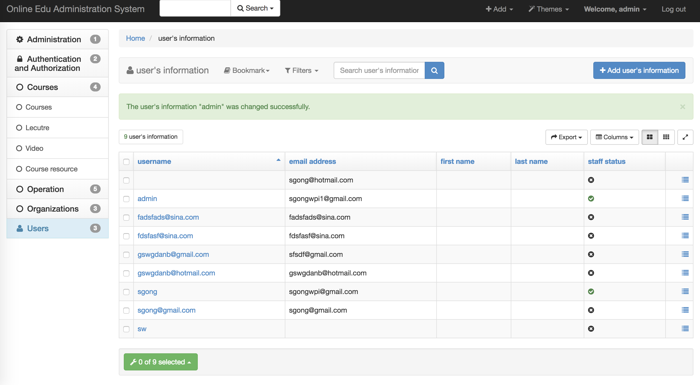
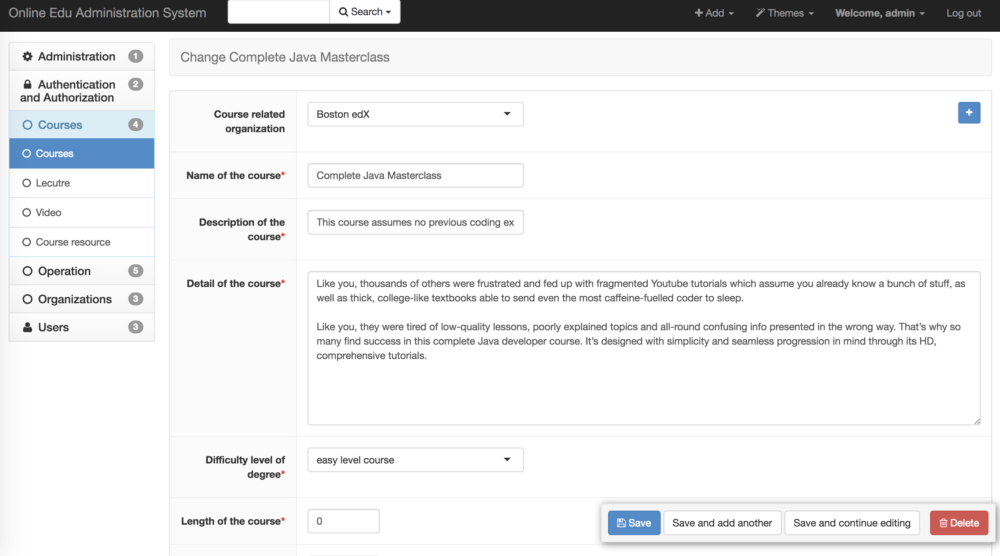

